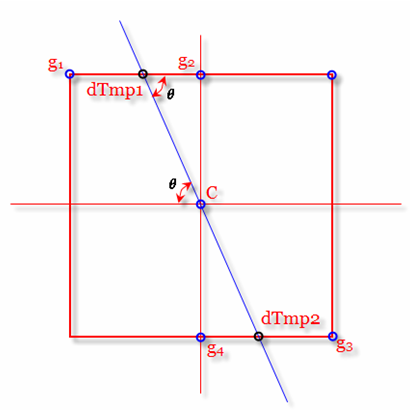
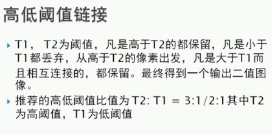
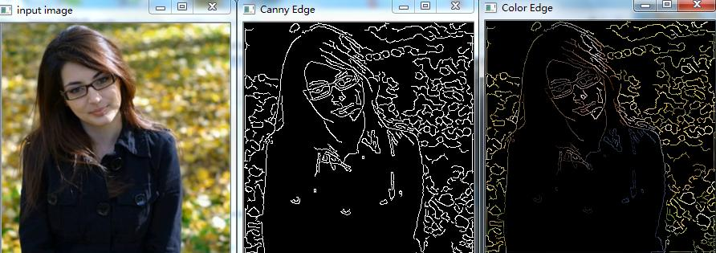
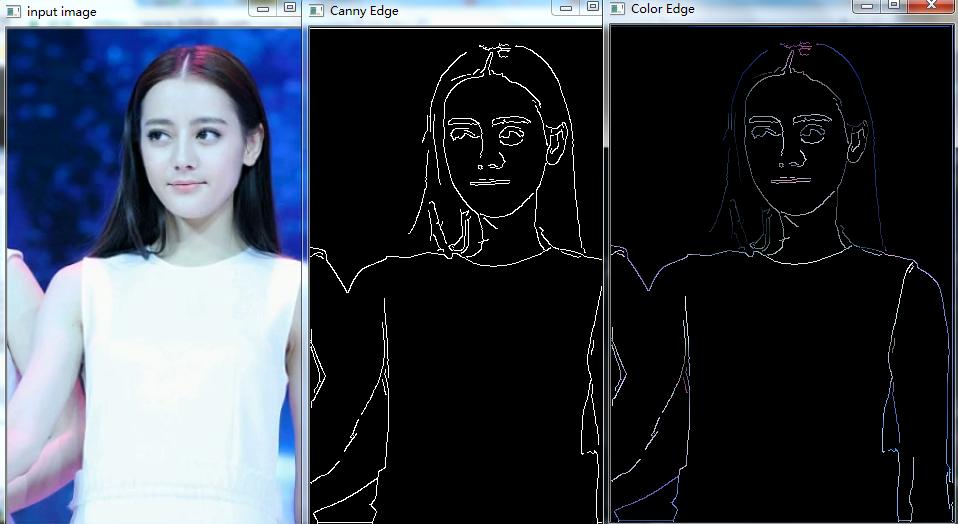

## 边缘提取
### 简介
边缘提取，指数字图像处理中，对于图片轮廓的一个处理。对于边界处，灰度值变化比较剧烈的地方，就定义为边缘，也就是拐点。  
拐点是指函数发生凹凸性变化的点。二阶导数为零的地方。并不是一阶导数，因为一阶导数为零，表示是极值点。  
边缘提取：边缘检测的基本思想首先是利用边缘增强算子，突出图像中的局部边缘，然后定义象素的“边缘强度”，通过设置阈值的方法提取边缘点集。由于噪声和模糊的存在，监测到的边界可能会变宽或在某点处发生间断。  
因此，边界检测包括两个基本内容： 
1. 用边缘算子提取出反映灰度变化的边缘点集。  
2. 在边缘点集合中剔除某些边界点或填补边界间断点，并将这些边缘连接成完整的线。 
边缘定义：图像灰度变化率最大的地方（图像灰度值变化最剧烈的地方）。图像灰度在表面法向变化的不连续造成的边缘。一般认为边缘提取是要保留图像的灰度变化剧烈的区域，这从数学上看，最直观的方法就是微分(对于数字图像来说就是差分)，在信号处理的角度来看，也可以说是用高通滤波器，即保留高频信号。
边缘信息包含两个方面：1.像素的坐标2.边缘的方向  

边缘是一幅图像中不同屈原之间的边界线，通常一个边缘图像是一个二值图像。边缘检测的目的是捕捉亮度急剧变化的区域，而这些区域通常是我们关注的。在一幅图像中两度不连续的区域通常是以下几项之一：
1. 图像深度不连续处
2. 图像（梯度）朝向不连续处
3. 图像光照（强度）不连续处
4. 纹理变化处

### 边缘提取算子
一阶:  Roberts算子、Sobel算子、Prewitt算子、Kirsch算子、Robinson算子  
二阶： Laplacian算子、Canny算子、Marr-Hildreth（LoG算子）  

#### Roberts 算子
Roberts算子，又称罗伯茨算子，是一种最简单的算子，是一种利用局部差分算子寻找边缘的算子。他采用对角线方向相邻两象素之差近似梯度幅值检测边缘。检测垂直边缘的效果好于斜向边缘，定位精度高，对噪声敏感,无法抑制噪声的影响。  
Roberts算子检测方法对具有陡峭的低噪声的图像处理效果较好，但是提取边缘的结果是边缘比较粗，因此边缘的定位不是很准确。  

#### Sobel算子
Sobel算法是一个离散的一阶差分算子，用来计算图像亮度函数的一阶梯度之近似值。在图像的任何一点使用此算子，将会产生该点对应的梯度矢量或是其法矢量。   

#### Prewitt算子
Prewitt算子是一种一阶微分算子的边缘检测，利用像素点上下、左右邻点的灰度差，在边缘处达到极值检测边缘，去掉部分伪边缘，对噪声具有平滑作用。  
其原理是在图像空间利用两个方向模板与图像进行邻域卷积来完成的，这两个方向模板一个检测水平边缘，一个检测垂直边缘。  
Prewitt算子检测方法对灰度渐变和噪声较多的图像处理效果较好。但边缘较宽，而且间断点多。  

#### Kirsch算子
Kirsch算子是R.Kirsch提出来一种边缘检测算法，它采用8个3*3的模板对图像进行卷积，这8个模板代表8个方向，并取最大值作为图像的边缘输出，它在保持细节和抗噪声方面都有较好的效果。  

#### Robinson算子
规则同Kirsch算子一样，也是8个模板

#### Laplacian算子
Laplacian算子法对噪声比较敏感，所以很少用该算子检测边缘，而是用来判断边缘像素视为与图像的明区还是暗区。  
Laplacian 算子是n维欧几里德空间中的一个二阶微分算子，定义为梯度grad的散度div。可使用运算模板来运算这定理定律。  
函数的拉普拉斯算子也是该数的黑塞矩阵的迹,可以证明，它具有各向同性，即与坐标轴方向无关，坐标轴旋转后梯度结果不变。  
Laplacian 算子对噪声比较敏感，所以图像一般先经过平滑处理，因为平滑处理也是用模板进行的，所以，通常的分割算法都是把Laplacian 算子和平滑算子结合起来生成一个新的模板。  

#### Canny算子
Canny方法不容易受噪声干扰，能够检测到真正的弱边缘。  
优点在于，使用两种不同的阈值分别检测强边缘和弱边缘，并且当弱边缘和强边缘相连时，才将弱边缘包含在输出图像中。  
该算子效果较好，但是它实现起来较为麻烦，Canny算子是一个具有滤波，增强，检测的多阶段的优化算子，在进行处理前，Canny算子先利用高斯平滑滤波器来平滑图像以除去噪声，Canny分割算法采用一阶偏导的有限差分来计算梯度幅值和方向，在处理过程中，Canny算子还将经过一个非极大值抑制的过程，最后Canny算子还采用两个阈值来连接边缘。  

#### Marr-Hildreth（LoG算子）
LoG可以看成是一个高斯模板的拉普拉斯变换   Laplace of Gaussian  
（图像的高斯拉普拉斯（LoG），可利用差分高斯（DoG）近似）  

## Canny边缘提取
### Canny算法介绍
#### 目标
Canny 的目标是找到一个最优的边缘检测算法，最优边缘检测的含义是：  
好的检测- 算法能够尽可能多地标识出图像中的实际边缘。  
好的定位- 标识出的边缘要尽可能与实际图像中的实际边缘尽可能接近。  
最小响应- 图像中的边缘只能标识一次，并且可能存在的图像噪声不应标识为边缘。  
#### Canny步骤  
1. 高斯模糊--GaussianBlur 消除噪声。  
一般情况下，使用高斯平滑滤波器卷积降噪。因为canny是对噪声敏感的算法，所以先降噪，但是降噪不要太过，以免丢失。  
2. 灰度转换--cvtColor　　
3. 计算梯度--Sobel/Scharr
4. 非最大信号抑制
5. 高低阈值输出二值图像

#### 非最大信号抑制
  
在Canny算法中，非极大值抑制是进行边缘检测的重要步骤，通俗意义上是指寻找像素点局部最大值，将非极大值点所对应的灰度值置为0。   
sobel算子中有一个x,y  
根据x,y可以求出一个θ角度  
1. 要进行非极大值抑制，就首先要确定像素点C的灰度值在其8值邻域内是否为最大。是最大则下一步。  
2. 图中蓝色的线条方向为C点的梯度方向，这样就可以确定其局部的最大值肯定分布在这条线上，也即出了C点外，梯度方向的交点dTmp1和dTmp2这两个点的值也可能会是局部最大值。因此，判断C点灰度与这两个点灰度大小即可判断C点是否为其邻域内的局部最大灰度点。   
3. 如果经过判断，C点灰度值小于这两个点中的任一个，那就说明C点不是局部极大值，那么则可以排除C点为边缘。  
完成非极大值抑制后，会得到一个二值图像，非边缘的点灰度值均为0，可能为边缘的局部灰度极大值点可设置其灰度为128。  
根据下文的具体测试图像可以看出，这样一个检测结果还是包含了很多由噪声及其他原因造成的假边缘。因此还需要进一步的处理。  

#### 高低阈值输出二值图像
  

### Canny边缘提取实现
```
def edge_demo(image):
    #1.高斯模糊
    blurred = cv.GaussianBlur(image,(3,3),0)
    #2.灰度转换
    gray = cv.cvtColor(blurred,cv.COLOR_RGB2GRAY)
    #3.计算梯度
    xgrad = cv.Sobel(gray,cv.CV_16SC1,1,0)  #canny方法API要求不允许使用浮点数
    ygrad = cv.Sobel(gray,cv.CV_16SC1,0,1)
    #4.Canny方法中包含非最大信号抑制和双阈值输出
    edge_output = cv.Canny(xgrad,ygrad,50,150)  #50是低阈值，150是高阈值
    cv.imshow("Canny Edge",edge_output)

    dst = cv.bitwise_and(image,image,mask=edge_output)　　#相与，获取颜色
    cv.imshow("Color Edge",dst)

src = cv.imread("./g.png")  #读取图片
cv.namedWindow("input image",cv.WINDOW_AUTOSIZE)    #创建GUI窗口,形式为自适应
cv.imshow("input image",src)    #通过名字将图像和窗口联系

edge_demo(src)

cv.waitKey(0)   #等待用户操作，里面等待参数是毫秒，我们填写0，代表是永远，等待用户操作
cv.destroyAllWindows()  #销毁所有窗口
```   


### 使用Canny计算梯度
```
def edge_demo(image):
    #1.高斯模糊
    blurred = cv.GaussianBlur(image,(3,3),0)
    #2.灰度转换
    gray = cv.cvtColor(blurred,cv.COLOR_RGB2GRAY)
    #3.直接传入灰度图像，Canny方法中包含计算梯度，非最大信号抑制和双阈值输出
    edge_output = cv.Canny(gray,50,150)  #50是低阈值，150是高阈值
    cv.imshow("Canny Edge",edge_output)

    dst = cv.bitwise_and(image,image,mask=edge_output)
    cv.imshow("Color Edge",dst)
```  


### Canny方法
#### 求出梯度
使用带自定义图像渐变的Canny算法在图像中查找边缘:  
```
Canny(dx, dy, threshold1, threshold2[, edges[, L2gradient]]) -> edges
```  

dx 参数表示输入图像的x导数（x导数满足16位，选择CV_16SC1或CV_16SC3）。   
dy 参数表示输入图像的y导数（y导数满足16位，选择CV_16SC1或CV_16SC3）。  
threshold1 参数表示设置的低阈值。  
threshold2 参数表示设置的高阈值，一般设定为低阈值的3倍 (根据Canny算法的推荐)。  
edges 参数表示输出边缘图像，单通道8位图像。  
L2gradient 参数表示L2gradient参数表示一个布尔值，如果为真，则使用更精确的L2范数进行计算（即两个方向的倒数的平方和再开方），否则使用L1范数（直接将两个方向导数的绝对值相加）。  

#### 直接调用Canny算法在单通道灰度图像中查找边缘
```
def Canny(image, threshold1, threshold2, edges=None, apertureSize=None, L2gradient=None): # real signature unknown; 
```  

image 参数表示8位输入图像。  
threshold1 参数表示设置的低阈值。 
threshold2 参数表示设置的高阈值，一般设定为低阈值的3倍 (根据Canny算法的推荐)。  
edges 参数表示输出边缘图像，单通道8位图像。  
apertureSize 参数表示Sobel算子的大小。  
L2gradient 参数表示一个布尔值，如果为真，则使用更精确的L2范数进行计算（即两个方向的倒数的平方和再开方），否则使用L1范数（直接将两个方向导数的绝对值相加）。  
